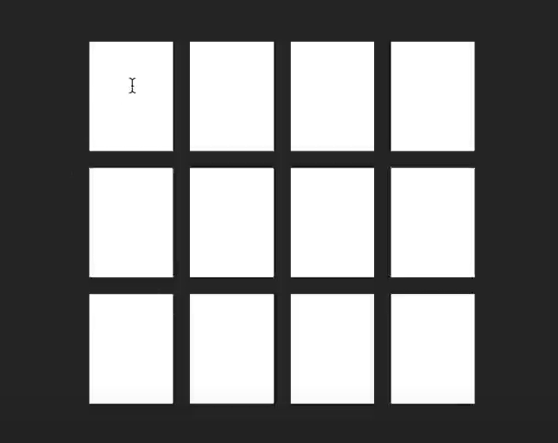

# React Memory Game Challenge

**Objective:**  
Build a memory game using React. This challenge is suitable for beginners and intermediate developers looking to improve their React skills. While it may not necessarily be asked in a coding interview, it covers fundamental concepts that are often quizzed in interviews and can help enhance your overall understanding of React and programming.

## Requirements:

1. **Grid Layout:**

   - Create a game board with a 4x4 grid of tiles.
   - Each tile should be clickable and display a symbol or image.

2. **Game Logic:**

   - Players should be able to click two tiles in an attempt to match them.
   - Both tiles will be visible for 1 second.
   - If the tiles match, they should remain visible. If they don't match, they should flip back after a short delay.
   - The game continues until all pairs are successfully matched.

3. **React Skills to Demonstrate:**

   - **State Management:** Use React's `useState` to manage the game state, such as selected tiles, matched pairs, and game progress.
   - **Rendering:** Implement dynamic rendering to display the grid and update the UI based on the game state.
   - **Event Handling:** Handle user interactions, such as clicking tiles, and trigger appropriate game responses.

4. **Optional Features:**
   - Add a timer to track how long it takes to complete the game.
   - Keep track of the number of moves made by the player.
   - Implement different difficulty levels (e.g., different grid sizes).

